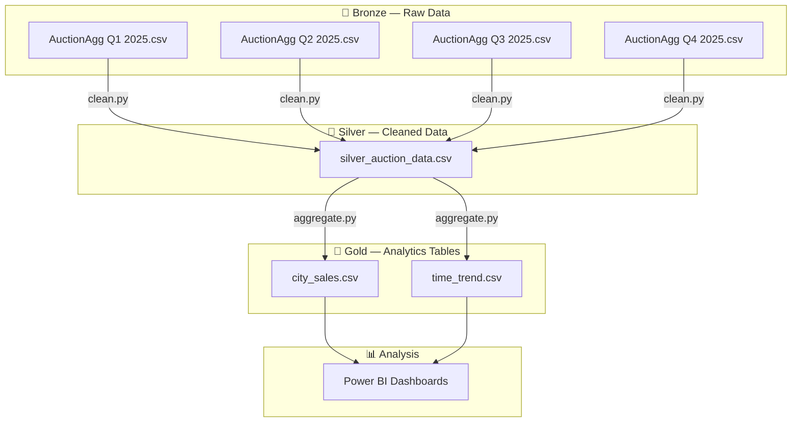

# Saudi Real Estate Data Pipeline

## Overview

This project analyzes Saudi real estate auction data, taking raw quarterly auction extracts and aggregating them into city-level and time-trend summary tables for analysis.

## Architecture



## Design intent

The project is structured around a Medallion (Bronze/Silver/Gold) mindset:

- Bronze: raw quarterly auction CSV exports, as received
- Silver: cleaning, standardization, and Arabic-text normalization
- Gold: aggregated analytics tables (city sales, time trends)

## What's in this repo today

- `AuctionAggQuarterElectronic Quarter1-4 2025*.csv` — raw quarterly auction data (Bronze)
- `clean.py` — cleans and normalizes raw CSVs → `silver_auction_data.csv`
- `aggregate.py` — aggregates cleaned data → `city_sales.csv` + `time_trend.csv`
- `city_sales.csv` — aggregated sales by city (Gold)
- `time_trend.csv` — time-series sales trend (Gold)
- `requirements.txt` — Python dependencies

## How to run

```bash
pip install -r requirements.txt
python clean.py       # Bronze → Silver
python aggregate.py   # Silver → Gold
```

## Technologies

- Python (Pandas)
- Planned: Microsoft Fabric for orchestration and deployment

## Key insights

- Top cities by total real estate sales
- Time-series trends of real estate sales

## Future work

- Deploy on Microsoft Fabric
- Build dashboards in Power BI

## Author

Ibrahim Abakar
